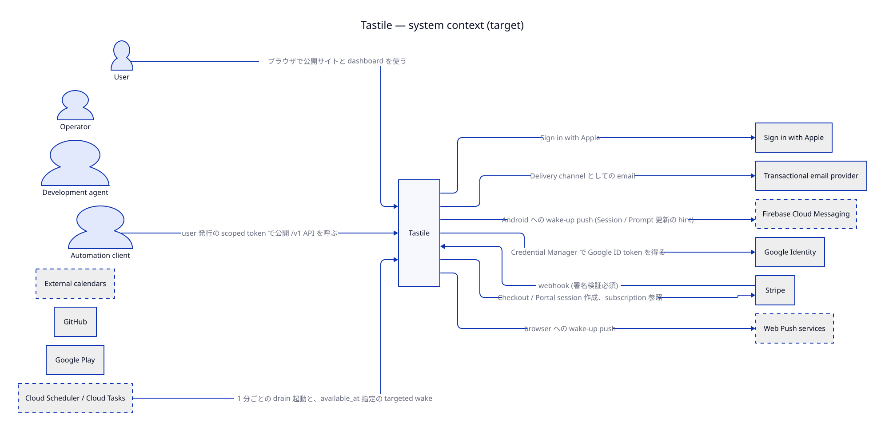

# 01 Context and goals

## Tastile とは (derived summary)

> この節は tastile-core `docs/product/README.md` (fd.product-definition) の **derived summary** である。
> 食い違う場合は core が正しく、この節を直す。

Tastile は **execution-control system** である。user の生活上の意図・要求・制約 (やりたいこと、締切、習慣、使える時間帯) を
受け取り、分単位の実行可能な時間構造 (Placement) に解決し、「今やること」を提示して実行させ、予定と現実がずれたら
再配置する。task の一覧管理や calendar の代替が目的ではない。「生活のフレームワーク」は、この仕組みを user の生活に対する
framework (primitive と mechanism の集合) として説明する product 上の位置付けである。

初期の user は、勤務時間ではなく集中した作業量が成果に直結するフリーランサー。Web と Android を先に完成させ、
Desktop / CLI が続き、iOS / macOS は将来。

## System context

- user は Web / Android / Desktop / CLI の thin client を使う (actor.user)。自動化は user 発行の scoped token で同じ API を使う
  (actor.api-client)。
- 意味と振る舞いは Core (ctr.core-api / ctr.core-worker) だけが実装する。client は表示・入力・OS 統合だけを持つ (term.thin-client)。
- 外部 calendar は補助入力であり SoT にしない (ext.google-calendar)。

## Quality goals

`model/quality.yaml` の順位が衝突時の優先順位である。

1. qg.data-integrity — 予定と実行の記録を黙って失わない。現在状態は durable fact から再構成できる。
2. qg.timeliness — 実行制御が時間どおりに働く。
3. qg.convergence — どの端末も同じ Effective 状態に収束する。
4. qg.security — owner isolation と credential hygiene。
5. qg.operability — 1 人で運用・deploy・復旧できる。
6. qg.cost — 収益前の固定費を小さく保つ。
7. qg.evolvability — provider を替えるコストを低く保つ。

qg.operability が qg.cost より上位なのは、2026-09 の停止の大半が安さではなく手作業境界 (VM、SSM、対話 login、secret 複製)
から生じたためである (evidence/2026-09-29-github-ops.md)。

## Constraints

- 運用者は 1 名 (risk.solo-operator)。production mutation・課金・公開判断は operator authority (ctl.prod-mutation-authority)。
- tastile-core は private、その他は public。private CI minutes は $2 cap で上げない (risk.ci-budget)。
- 言語: source / identifier / commit は英語、Issue / PR / 内部文書は日本語 (root AGENTS.md)。
- frontend と script は Bun。新規 Python script は作らない。
- 一般公開の告知前に target infra へ移る (ms.m9-public-announcement は ms.m8-decommission の後)。
