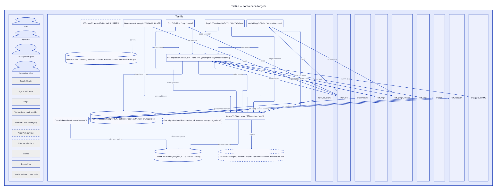
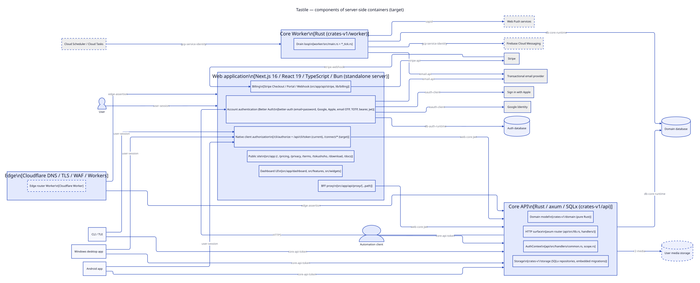
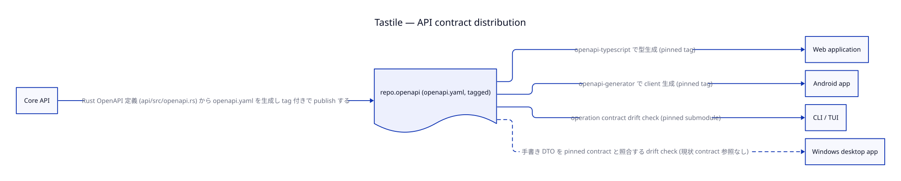

# 02 Structure — containers, components, communication

正本: `model/elements.yaml`、`model/relationships.yaml`。一覧: [generated/elements.md](../generated/elements.md)、
[generated/relationships.md](../generated/relationships.md)。

## Containers

| container | 責務 | 持たないもの |
| --- | --- | --- |
| ctr.core-api | Command API (書き込みの唯一の入口)、Read Model、Sync API、token、owner boundary | UI、account 認証 |
| ctr.core-worker | Work Item / Outbox の drain (materialization、horizon fill、execution due、decision、delivery、prompt) | 常駐 state、process 寿命に依存する意味 |
| ctr.core-migrate | deploy ごとの schema migration (DDL role) | runtime 処理 |
| ctr.domain-db | 唯一の system of record | derived cache の正本化 |
| ctr.web | 公開 site、dashboard (thin client)、BFF、Better Auth、native connect、billing UI | domain logic、domain DB への接続 |
| ctr.auth-db | Better Auth の identity data | domain data |
| ctr.edge | DNS / TLS / WAF / router | user identity 判断 |
| ctr.android / ctr.desktop / ctr.cli | 入力・表示・OS 統合 | Effective 計算、通知 policy、schedule 計算 |
| ctr.downloads / ctr.media | public object 配信 | 秘密 data |

## Components

- Core API 内: cmp.core.http → cmp.core.auth (唯一の認可点) → cmp.core.domain → cmp.core.storage。
- Web 内: cmp.web.site、cmp.web.dashboard、cmp.web.bff、cmp.web.auth、cmp.web.connect、cmp.web.billing。
- Edge 内: cmp.edge.router (planned)。

## 通信の原則

1. **書き込みは Command だけ** (ctl.command-only-writes)。actor と occurredAt は server が確定する。
2. **読み取りは Read Model、収束は Sync。** push (term.wakeup-push) は hint であり、失われても Sync + Read で正に戻る。
3. **BFF → Core は署名付き assertion** (rel.web-core, cred.web-core-jwt)。current の bridge secret は retiring (ADR-0016)。
4. **native client は connect flow で得た Core API token** (rel.native-connect, rel.desktop-connect, rel.cli-connect)。
5. **client は DB に触れない** (ctl.no-client-db)。Web server が触れる DB は auth DB だけ (rel.web-auth-db)。
6. **Core origin は server-side config からだけ解決する。** browser に内部 origin を出さない (2026-09-20 の localhost proxy
   incident の再発防止、poc.web-cloud-run c4)。
7. **API contract は Core が生成し tag で配布** (rel.core-contract → consumer、ADR-0019)。

## Thin client の境界

client に残してよいもの: 表示用 cache (正本ではない)、入力 UI、OS alarm / toast / tray / 介入 window、secure storage、
system browser 起動、offline 時の表示。

client から Core へ移すもの (oq.web-domain-logic、oq.android-local-logic、oq.alert-schedule):

- Web の Command / Event / Reducer / validator 実装
- Android の dead JNI bridge、`ExecutionAlarmPlanner`、`ConditionAstMirror`、local command queue
- Desktop の prompt auto-action / timeout / notification policy
