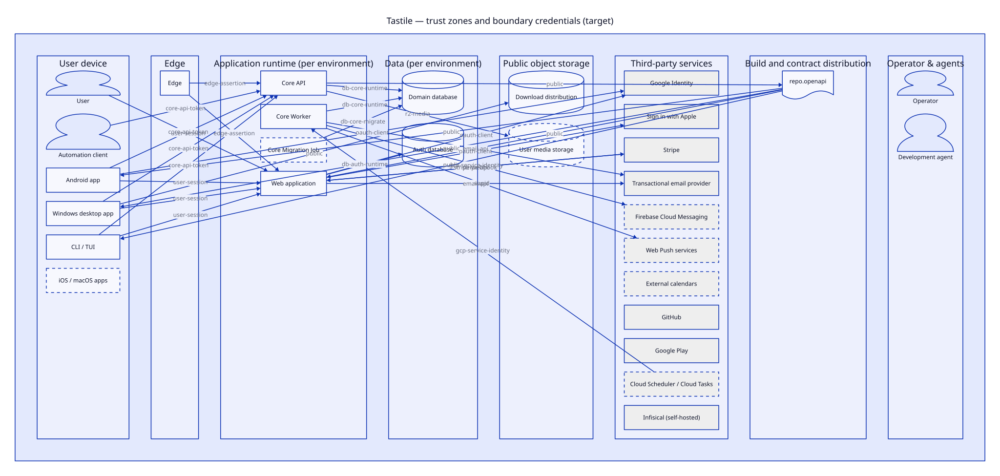

# 03 Trust and security

正本: `model/security.yaml`。一覧: [generated/security.md](../generated/security.md)。判断: ADR-0015、ADR-0016。

## Trust zones

| zone | 前提 |
| --- | --- |
| tz.user-device | 攻撃者の device でもあり得る。token は OS secure storage に置くが、漏洩前提で scope と expiry を短く保つ |
| tz.edge | TLS 終端と WAF。identity は判断しない |
| tz.app-runtime | environment ごとに別 GCP project、service ごとに別 service account。Web と Core は同 zone でも互いを暗黙に信頼しない |
| tz.data | Cloud SQL connector 経由のみ。authorized network を開けない |
| tz.public-object | R2。download は public、media は推測不能 key |
| tz.third-party | 外部 SaaS。webhook は署名検証必須 (ctl.webhook-signature) |
| tz.build | CI と生成 contract。publish job だけが secret を持つ |
| tz.operator | 開発者と agent。production data plane への常設経路を持たない |

validator は「zone をまたぐ関係は credential を持つ (public data のみを除く)」を機械的に検査する。

## Credentials

- **account session** (cred.user-session): Better Auth が発行。Core の credential ではない。
- **Core API token** (cred.core-api-token): opaque、hash 保存、`tastile.read` / `tastile.write` scope (write は read を含まない)、expiry / revoke。
- **Web-to-Core assertion** (cred.web-core-jwt): EdDSA、aud=tastile-core、exp ≤ 5 分、JWKS 検証。
- **bridge secret** (cred.web-bridge-secret): 全 user になりすませる shared secret。retiring。
- **edge assertion** (cred.edge-assertion): run.app 直アクセス拒否用。identity ではない。
- **workload identity** (cred.gcp-service-identity、cred.github-oidc-wif): key file を作らない。
- **DB roles**: `tastile_app` (DML)、`tastile_migrator` (DDL)、`tastile_auth` (auth DB のみ)。

## Secrets

- Tastile-managed secret実値の唯一の編集可能 store は Infisical (sec.single-editable-store)。development / CI / staging / production で同じsecret control planeを使う。
- 付与は secret 単位 IAM (sec.per-secret-iam)。repository 間・service 間で読めない。
- 長期 key を作らない (sec.no-long-lived-keys)。外部 SaaS の API key だけが例外として store に入る。
- 必須 secret が無ければ起動しない (sec.fail-closed)。dotenv や既定値に fallback しない。
- Infisical は current/target 共通のsecret control planeとして維持する。GitHubはOIDC、AWS current runtimeはAWS IAM、GCP target runtimeはGCP-native authでmachine identityへ入る。

## Data classification

dc.user-content (生活時間そのもの) は PII と同等以上に扱い、第三者 analytics に送らない。log には owner_id の hash だけを出し、
user-content と credential を出さない (ds.request-logs)。

## Authorization

- 認可判断は cmp.core.auth だけで行う。scope 判定は payload validation より前に行う
  (poc.core-suite-vanilla-pg で `tastile.read` の POST が 403 ではなく 422 を返す regression を検出)。
- 他 owner の resource は存在しないものとして扱う (ctl.owner-boundary)。
- auth bypass は local / ci でのみ有効化でき、staging / production は起動時に拒否する (iso.no-bypass-auth)。
