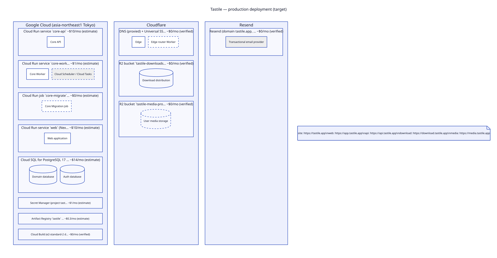
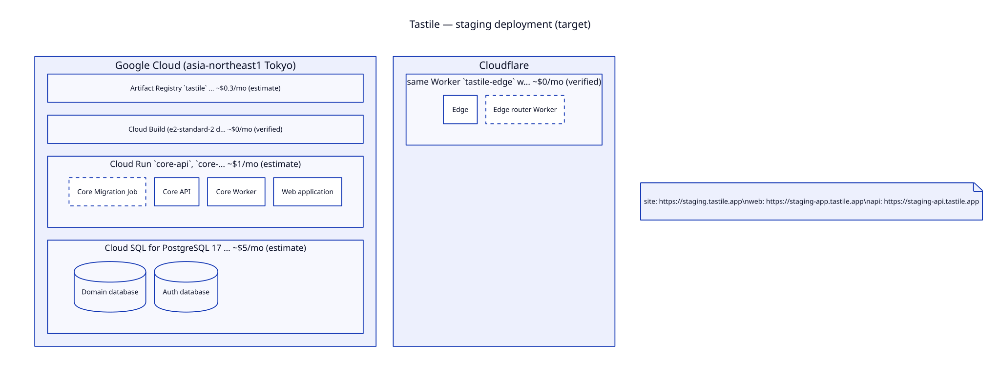
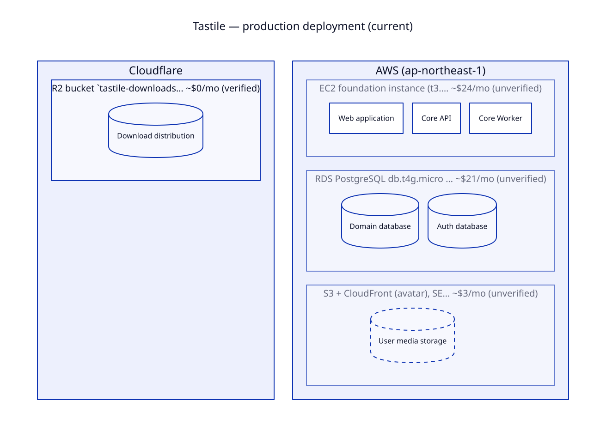

# 05 Infrastructure and environments

正本: `model/deployment.yaml`、`model/environments.yaml`。判断: ADR-0014 (platform)、ADR-0015 (secrets)、ADR-0017 (worker)。
一覧: [generated/deployment.md](../generated/deployment.md)、[generated/environments.md](../generated/environments.md)。

## 結論

| 層 | target | current (retiring) |
| --- | --- | --- |
| edge | Cloudflare DNS / Universal SSL / WAF / edge router Worker | Cloudflare proxied DNS → EC2 nginx |
| app runtime | Cloud Run (asia-northeast1): `core-api`, `web` (request-based, prod min 1), `core-worker` (sweep 起動), job `core-migrate` | EC2 + systemd (api / worker / web) |
| database | Cloud SQL PostgreSQL 17, env ごと 1 instance (domain + auth の 2 database) | RDS db.t4g.micro ×2 |
| secrets | self-hosted Infisical (OIDC / GCP-native machine identity) | self-hosted Infisical + legacy copies |
| background trigger | Cloud Scheduler (1 分 sweep) + Cloud Tasks (wake) | 5 秒常駐 loop |
| objects | R2 (downloads, media) | R2 (downloads), S3 + CloudFront (avatar) |
| email | Resend | SES (sandbox) |
| build | Cloud Build (core CI + all images), GitHub Actions (public repos) | GitHub Actions (private minutes 枯渇) |

## なぜこの形か

判断の全文と比較表は ADR-0014 と evidence/2026-09-29-platform-evaluation.md。要点:

1. **VM を無くす。** 2026-09 の deploy 失敗 (SSM quoting、systemd 上の対話 login、WorkingDirectory、45 分 deploy、IAM 範囲) は
   VM と手組み deploy 経路に由来する。Cloud Run は immutable revision と traffic 切替で deploy / rollback を 1 操作にする。
2. **Tokyo に compute と DB を同居させる。** Neon は Tokyo に無い。Supabase は PITR が高額。Cloud SQL は PITR 込み。
3. **常駐しない worker。** Work Item table が正本なので、起動は scheduler の hint でよい。常駐 (≈ $50 / 月) を避ける。
4. **secret と cloud identity を分離する。** secret実値はInfisicalに一意化し、GitHub OIDC・GCP service account/WIFはshort-lived identity proofとして使う。long-lived keyを作らない。
5. **Cloudflare は edge として残す。** DNS・WAF・R2 は既に機能しており egress も無料。Web を Workers で動かす構成は
   Node と workerd の二 runtime 差と DB 到達の複雑さから採らない。
6. **exit を安く保つ。** 契約は OCI image + vanilla PostgreSQL + HTTP + 標準 JWT。Cloud Run 固有 API を Core に入れない。

## 費用

`bun run architecture:validate` が deployment.yaml の node 費用を集計し `quality.yaml` の予算 (pre-launch $45 / 月) と比較する。
2026-09-29 時点の見積もりは target 期待値 ≈ $42 / 月 (上限 ≈ $70: Workers Paid・Resend Pro・Cloud Build 超過を含む)、
current (AWS、請求未確認) ≈ $93 / 月。実請求は live state (fd.billing-actuals) で、poc.cost-30d で確認する。

## Environments

| env | 目的 | data | hostname |
| --- | --- | --- | --- |
| env.local | 開発 | 合成のみ | localhost |
| env.ci | 自動検査 | job ごとの PG service | — |
| env.staging | RC の実 browser / device / DB 検証、migration・restore 演習 | 合成 + test account、reset 可 | staging.tastile.app / staging-app.tastile.app / staging-api.tastile.app |
| env.production | 実 user | 永続 | tastile.app / app.tastile.app / api.tastile.app / download.tastile.app / media.tastile.app |
| env.preview | retiring (staging と DB を共有していたため) | — | — |

isolation (iso.*): environment 間で DB・secret・identity・bucket・backup 先を共有しない。production data を下流へ copy しない。
staging の security mode は production と同じ。同じ artifact digest を promotion する。auth bypass は local / ci のみ。

hostname は Universal SSL が効く一段 subdomain に限る (nested hostname は Free zone で edge TLS が成立しなかった)。

## current state (cutover まで)

current の手順書は tastile-core `docs/production/` (AWS runbook) で、cutover (ms.m6-cutover) までは current state の手順として有効。
target の事実と食い違う場合、target については本 directory が正しい。
