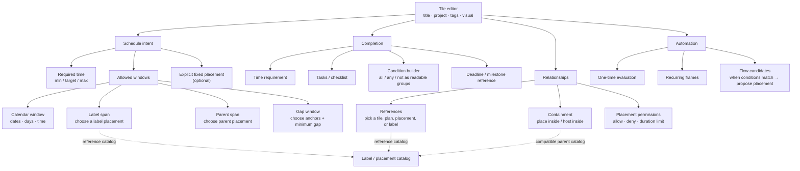

# Compositional Scheduling Input Implementation Plan

> **For Codex:** REQUIRED SUB-SKILL: Use superpowers:executing-plans to implement this plan task-by-task.

**Goal:** Let users compose flexible schedules from duration, completion, windows, references, nesting, and flow rules without forcing a fixed Placement or exposing v1 internal IDs.

**Architecture:** Make one core command the authoritative aggregate-writing boundary: it creates or updates a Tile, Plan, Recurring/Frame where required, Window rows, references, completion terms, placement/nesting rules, and flow candidates in one transaction. The web editor is a projection of that aggregate: every panel edits one named domain concept and every reference is selected from a queryable catalog rather than entered as an ID.

**Tech Stack:** Rust v1 domain/storage/api, PostgreSQL, Next.js 16, TypeScript, Vitest, Playwright.

---

## Severity and dependency order

### P0 — Data model cannot be saved (blocker)

The editor's store contains windows, completion, references, and planning data, but the current create command reduces creation to a fixed Placement or a recurring command with start/end. A UI improvement here would be cosmetic and destructive.

**Required outcome:** a transactional command/API that persists the complete v1 aggregate without creating a Placement unless a Flow or explicit fixed-placement choice requests one.

### P1 — Core composition is unreachable (blocker)

Window LABEL_SPAN/PARENT_SPAN/GAP, References, Completion, PlacementRule, NestingRule, and Flow have no complete, typed create/edit route. Raw UUID and numeric inputs are not an input model.

**Required outcome:** every composition node has an API payload and read projection with stable IDs and validation errors.

### P2 — Users cannot choose references (critical)

A condition or window can only refer to another aggregate by manually entering its ID. This prevents the natural flow “choose the semester label → use its span as the availability window”.

**Required outcome:** reference picker queries labels, placements, plans, and compatible scopes; it filters invalid/cyclic choices and shows human-readable summaries.

### P3 — UI exposes implementation syntax (critical)

ALL/ANY/NOT trees, numeric kinds, and `referenceId` fields expose AST/storage mechanics instead of scheduling intent.

**Required outcome:** panel controls translate intent into the same typed AST. The structural tree remains inspectable as a readable summary, never the primary input language.

### P4 — Summary and navigation are incoherent (high)

The base panel duplicates fields and hides routine data. It must become a concise live summary plus direct-access controls, while each domain concept has one editing home.

---

## UI tree

### Base panel rules

- Always visible: title, project, tags, color/icon, required-time summary, window summary, completion summary.
- One click opens exactly one owner panel; no generic Advanced section.
- A summary is derived from the same data edited in that panel. It is never a second editor for that data.
- Fixed start/end is absent until the user explicitly chooses an explicit Placement.

---

## Implementation phases

### Phase 1: Core aggregate command (P0)

**Core files:** `crates/v1/domain/src/command.rs`, `crates/v1/storage/src/dispatcher.rs`, `crates/v1/storage/src/*_repo.rs`, `crates/v1/api/src/handlers/commands.rs`.

1. Specify a `CreateScheduleDefinition` payload with typed child rows for Plan, Window, Reference, Completion, PlacementRule, NestingRule, and Flow.
2. Write domain validation tests: no raw JSON persistence, UUIDv7 IDs, valid reference target kinds, no cyclic nesting, no invalid range/span.
3. Implement one transaction that writes all requested rows or writes none.
4. Add command-worker E2E for a semester LABEL window and a duration-bound task; assert no Placement exists before a flow materializes one.

### Phase 2: Read model and reference catalog (P1/P2)

**Core files:** `crates/v1/api/src/handlers/read.rs`, new reference-catalog handler, storage read queries.

1. Return an editor projection containing all composition nodes and their human-readable labels.
2. Add catalog endpoints scoped by compatible target: labels, placements, plans, parent-capable placements, gap anchors.
3. Add validation diagnostics for deleted/closed/unavailable references.

### Phase 3: Web aggregate adapter (P1)

**Web files:** new `src/lib/api/v1/schedule-definition.ts` and tests; retire creation-time dependence on `createManualPlacementCommand`.

1. Map editor state to the aggregate command without synthesizing start/end.
2. Map API editor projection back into the store for editing.
3. Add request tests for the semester-label scenario and deadline scenario.

### Phase 4: Compositional editor panels (P3/P4)

**Web files:** split `QuickTileCreate.tsx` into `TileEditorShell`, `SchedulePanel`, `CompletionPanel`, `RelationshipsPanel`, `AutomationPanel`, `ReferencePicker`.

1. Build the base summary first, with no duplicate inputs.
2. Implement Window panel and picker flows before exposing Flow.
3. Implement completion and relationship panels with readable condition rows.
4. Add Flow only after a proposal can reference a configured Plan and Window.
5. Remove numeric kind inputs and direct UUID text fields from user-facing panels.

### Phase 5: Acceptance coverage

- Fixed meeting: explicit Placement uses exact start/end.
- Semester task: LABEL placement → LABEL_SPAN window → required time → Flow proposal; no initial Placement.
- Deadline homework: deadline/milestone condition plus required time and allowed window.
- Daily study: recurring frame + 22:00 calendar window + required time.
- Browser tests cover keyboard traversal, reference selection, invalid-reference diagnostics, and no duplicate editor controls.

## Boundaries

- Always: preserve v1 aggregate boundaries; test domain, API, and web adapter separately; use numeric constants only internally.
- Ask first: schema migrations, public command/API changes, migration of existing user data.
- Never: encode references as user-entered UUIDs; create a Placement merely to represent a deadline/window; add task-type-specific flags; persist aggregate state in JSONB.

## Acceptance criteria

- Every v1 composition concept needed for scheduling is either directly editable or deliberately excluded with a visible reason.
- The “semester LABEL span” path can be built without IDs or a fixed task span.
- No base summary duplicates the editor for the same property.
- Fixed placement is optional and never synthesized for a flexible task.
- Core rejects invalid aggregate definitions atomically and reports actionable diagnostics.
